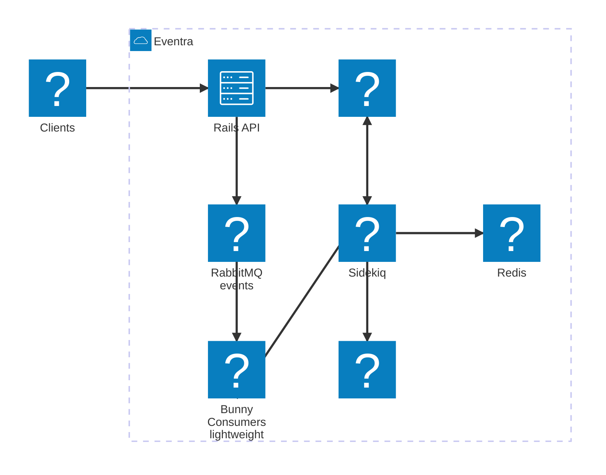

```mermaid
---
config:
  layout: elk
---
architecture-beta
    service clients(logos:codesandbox-icon)[Clients]
    
    group eventra(cloud)[Eventra]

        service rails(server)[Rails API] in eventra
        service rabbitmq(logos:rabbitmq-icon)[RabbitMQ events] in eventra
        service bunny(logos:rubygems)[Bunny Consumers lightweight  ] in eventra
        service sidekiq(logos:sidekiq-icon)[Sidekiq] in eventra
        service redis(logos:redis)[Redis] in eventra
        service db(logos:postgresql) in eventra
        service elasticsearch(logos:opensearch) in eventra

    clients:R --> L:rails
    rails:R --> L:db
    rails:B --> T:rabbitmq

    rabbitmq:B --> T:bunny
    bunny:B --> T:sidekiq

    sidekiq:T --> B:db
    sidekiq:R --> L:redis
    sidekiq:B --> T:elasticsearch


```